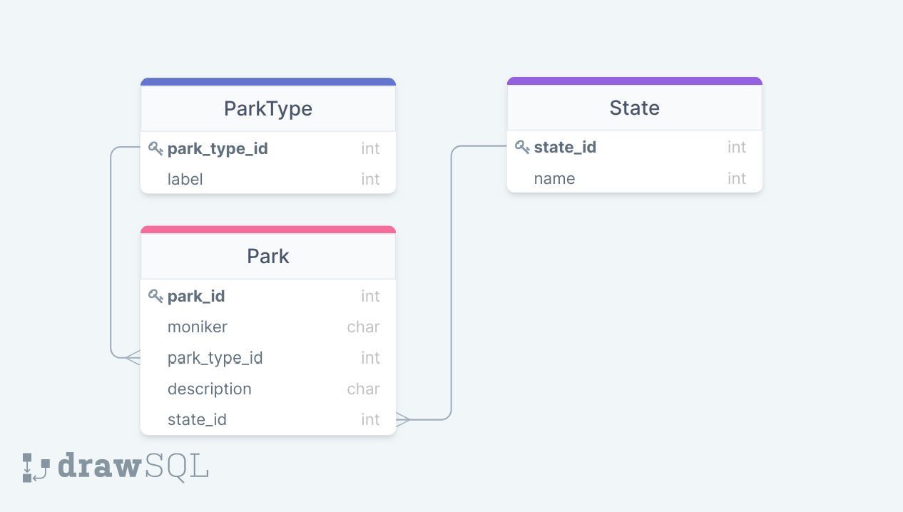

# SQL Challenge

For this challenge, you will need to write 3 sql statements. The __only__ code that needs to change is in the `views/parks_requests.py` file. In that file, there are 3 TODO's to write the sql statements needed. 

Along with assessing your sql skills this will also assess your ability to solve problems and ask for help. Use your resources! This includes instructors, google, and past projects. This does not include teammates. 

## ERD
Here is the ERD for this challenge:

## Set Up
After cloning the repo:
1. `pipenv shell`
2. `pipenv install`
3. `touch db.sqlite3`
4. Connect to the database file and run all the sql commands inside the `seed_db.sql` file. This will create the tables and insert the data
## Requirements
1. The `get_all_parks` sql is assessing your knowledge of `joins`. It should return all the parks along with the state name and park type label.
2. The `get_parks_by_type` sql is assessing your knowledge of filtering. It should return the parks associated with a specific park type
3. The `get_parks_ordered_by_name` sql is assessing your sorting knowledge. It should return the parks sorted alphabetically by their moniker

## Testing Locally

### Testing with Postman
1. Running the server: `flask run`
2. In Postman the url's to use are
    
    1. Testing **`get_all_parks`**: `http://localhost:5000/parks`
    2. Testing **`get_parks_by_type`**: `http://localhost:5000/parks?type=1`
    3. Testing **`get_parks_ordered_by_name`**: `http://localhost:5000/parks?order_by=name`

### Running the UnitTest file
To see the test output before pushing to github: `python3 test_parks.py`
